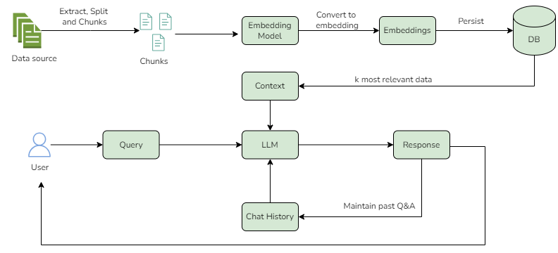

# RAG Chatbot
RAG (Retrieval-Augmented Generation) ChatBot that provides answers by incorporating contextual knowledge base provided within files.

## Use Cases
* Customer support chatbot which can handle users in general enquiries.
* System can be extened to handle advance user queries by embedding user speficis details.
## Prerequisites

* Python
* LangChain
* Streamlit
* boto3
* AWS Bedrock
* Llama2
* faiss-cpu

## Architecture


## Run the RAG Chatbot

To interact with a GUI type:
```shell
streamlit run rag_chatbot_ui.py
```
## User Interface

## Reference

* LangChain
    * https://python.langchain.com/docs/get_started/introduction/
* Streamlit
    * https://docs.streamlit.io/
* AWS Bedrock
    * https://aws.amazon.com/bedrock/
* Llama2
    * https://llama.meta.com/llama2/
    * https://aws.amazon.com/bedrock/llama/
* faiss-cpu
    * https://pypi.org/project/faiss-cpu/
